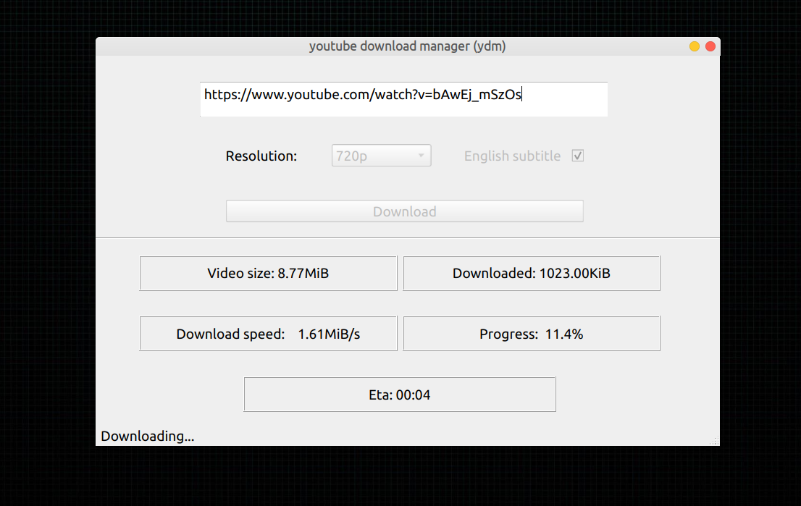

# YouTube Download Manager (YDM)

**Ensure python (3.9+) is installed in your system then follow the following steps:**

- Clone the repo or download the source codes.

- Install the dependencies first: `pip3 install -r requirements.txt`

- Then run YDM by this command: `python3 ydm.py`
